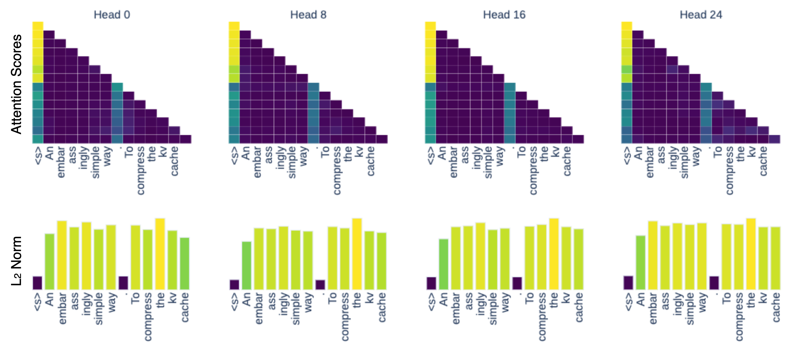

# L2 Norm-Based KV Cache Compression

> News: The K-norm based compression is now also implemented and available in the [Nvidia KVPress library](https://github.com/NVIDIA/kvpress?tab=readme-ov-file#installation)

Repository for [*A Simple and Effective L2 Norm-Based Method for KV Cache Compression*](https://arxiv.org/abs/2406.11430), presented at EMNLP 2024.

<div align="center">
  
</div>

**TL;DR** Tokens with low $L_2$ norm in their key embeddings correlate strongly with high attention scores (see figure). By selectively pruning the KV Cache to retain these important low-norm tokens, we reduce memory usage while maintaining model performance during inference.

### Installation

After cloning the repo, install dependencies with:

```bash
pip install -r requirements.txt
```

### Quickstart

You can use the $L_2$ Norm-based compression with any model from the Hugging Face Model Hub! Below is an example that demonstrates how to prune the KV cache after a forward pass.

```python
from cache import l2_compress

# Load a pre-trained language model
model = AutoModelForCausalLM.from_pretrained("your_model_id")

# Forward pass with cache enabled
outputs = model(some_input_ids, use_cache=True)

# Compress the KV cache by keeping only the top 90% most significant values
compressed_cache = l2_compress(
    outputs.past_key_values,  # original KV cache
    keep_ratio=0.9,           # percentage of cache to retain based on significance, set to 1 for no compression 
    prune_after=1048,         # prune the KV Cache only if it contains more that this amount of tokens
    skip_layers=[0, 1]        # skip compression for layers 0 and 1
)

# Use the compressed KV cache in a subsequent forward pass
outputs = model(
    some_other_input_ids,                   
    past_key_values=compressed_cache,  
    use_cache=True               
)
```

Check `notebooks/basic_example.ipnyb` for an example!

### Quick Language Modeling Experiment

To evaluate the model with compressed KV cache on a subset of Wikipedia data, run:

```bash
python eval_lm_quick.py \
    --model_id=meta-llama/Meta-Llama-3-8B \
    --chunk_size=3000 \             # size of the input dataset
    --keep_ratio=0.98 \             # percentage of cache to retain based on significance, set to 1 for no compression 
    --prune_after=1000 \            # prune the KV Cache only if it contains more that this amount of tokens
    --output_dir=<your_local_output_dir>
```

This script will compute and save scores to the specified output directory.

### Reproducing Experiments

For full experiments across various tasks, please refer to:

- **Language Modeling**: `eval_lm.py`
- **Needle-in-a-Haystack Retrieval**: `eval_needle.py`
- **Passkey Retrieval**: `eval_passkey.py`

Each script includes command-line arguments to adjust parameters and model configurations.

### Citation

If you find this code or our work helpful, please consider citing:

```bibtex
@article{devoto2024simpleeffective,
    title={A Simple and Effective {$L_2$} Norm-Based Strategy for {KV} Cache Compression},
    author={Devoto, Alessio and Zhao, Yu and Scardapane, Simone and Minervini, Pasquale},
    booktitle={Proceedings of the 2024 Conference on Empirical Methods in Natural Language Processing (EMNLP)},
    year={2024},
    url={https://arxiv.org/abs/2406.11430}
}
```

### Contact

For more information, feel free to reach out ot [Alessio Devoto](https://alessiodevoto.github.io) or [Yu Zhao](https://yuzhaouoe.github.io/)!

